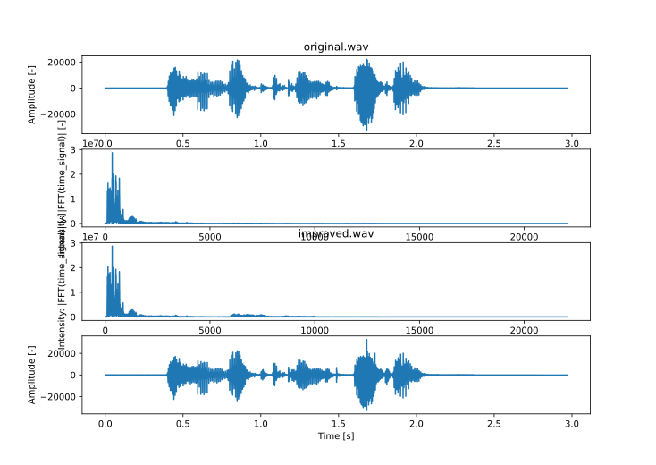

# Assignment 1: Fourier Transform 
### Digital Signal Processing
#### Allan Omar Hernandez Cotto & Szymon Gula

#### Introduction 
This report is outcome of the DSP assignment about Fourier Transform.

#### Part 1
Using the GarageBand software and external microphone we have recorded the ```"Remember to drink water"``` sentence. 
To ensure sufficient voice quality, we used the ```44.1 kHz``` sampling rate and ```16 bits per sample``` WAVE encoding.

#### Part 2
To load the WAVE file we used the ```scipy.io.wavfile``` package, that returns the signal sample rate and array of signal values from decoded file.
In the *figure 1A* we presented the decoded audio signal in the time domain, in the *figure 1B* we show the signal in the frequency domain. 
The frequency domain of the signal was found by Fast Fourier Transform (FFT), and for presentation purpose we calculated absolute value on the FFT output.


__Fig. 1__: Plot A - recorded signal in time domain, 
Plot B - recorded signal in frequency domain, 
Plot C - modified frequency domain to improve listener perception of the voice, 
Plot D - reconstructed time signal from modified frequency spectrum
#### Part 3

#### Part 4
For the recorded signal, we found that the region between ```<85 Hz, 250 Hz>``` corresponds to the base frequencies of recorded signal.
To increase amplitude for mentioned region, we decided to multiply FFT output for corresponding frequencies by ```1.25```. Secondly, the region in range ```<6000 Hz, 10000 Hz>``` was multiplied by ```10.0```.

The frequency spectrum achieved in such a way (visualized in *figure 1C*) was used to generate new time signal with improved user voice perception. 
To achieve it the we use Inverted Fourier Transform function. The final time signal is presented in the *figure 1D*.
  
 #### Part 5
Given the msc_matric_3.dat file we have loaded the time-series data to decode telephone number. To decode digits, we have implemented the single digit recognition based on the time-sequence. Then, we implemented constant-size window iterator (generate consecutive chunks of same size from series) and for each subsequence we decoded a digit. 

As a result, we achieved following phone number: ```0013-104-558-858```
 