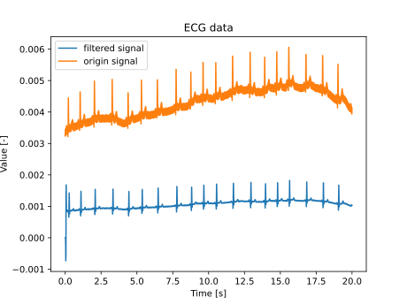
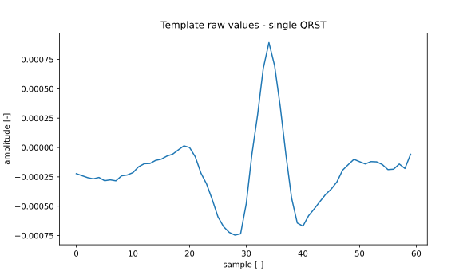
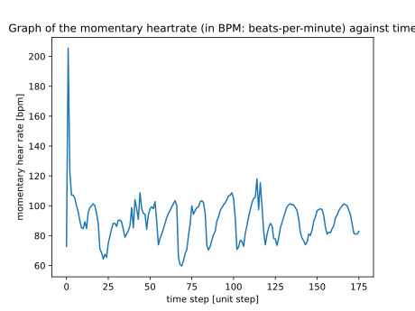

## 1 ECG filtering
### Ex 1

#### ! TODO - check all 'heart' ('hear')

The code is using collowing implementation structure:

    class FIRFilter:
        def __init__(self, impulse_response_coef: np.array) -> None:
            """
            FIR filter setup method, that converts class into function like (callable) object
            :param impulse_response_coef: FIR filter coefficients
            """
    
        def __call__(self, new_val: float) -> float:
            """
            Filter object executable method
            :param new_val: new input value
            :return: filtered output (delayed compared to input)
            """
    
        def do_filter(self):
            """
            Filter execution for given past states and filter coefficients
            :return: single step filtered output
            """
Mentioned design was selected because:
 - class design allows code reusability and easy access from other python modules
 - the call method was used due to "functional" character of the task
 - allows class inheritance for higher level classes
 
 To provide the 'queue' like data structure we used the ```deque``` class from ```collections```. It is high optimized python data structure that supports fixed buffer size and ``` append ``` functionality.
 
 
### Ex 2
 
 For the basic implementation test we wrote two basic unittests. 
 
 
    class TestFIR(unittest.TestCase):
        """
        Testing area
        """
        def test_initialization(self):
            """
            Smoke unit test.
            Checks if the initialization and inheritance do not break
            """
    
        def test_fir_base_class(self):
            """ 
            Test FIR responce to the impulse - for predefined coefficents.
            """
    
 The test are executed when the file is executed as the main script.
 
### Ex 3
  
  According to Szymon's university number we have selected following data file: ```ECG_msc_matric_3.dat ```.
  
  To remove the DC and 50Hz noise we designed the FIR factory that extends ```FIRFilter``` class and calculates the FIR filter coefficients.
  The ```FIRFilterFactory```, except number of tabs in filer, it takes the frequency range to remove, and window type. 
  
    class FIRFilterFactory(FIRFilter):
        def __init__(self, num_taps: int, norm_freq_list: list, pass_zero: bool, window_type: 'str' = 'triangle') -> None:
            """
            FIR filter designed (based on the FIRFilter class)
            :param num_taps: number of tabs in the FIR filter
            :param norm_freq_list: list of frequencies to remove
            :param pass_zero: flag if first given frequency is passed or removed
            :param window_type: filter window type
            """
    
        def _initialize_impulse_response(self) -> np.array:
            """
            Based on the defined cutoff frequency - design the FIR filter coefficients
            :return: raw filter coefficients
            """
    
        def _initialize_window(self) -> np.array:
            """
            Initialized the window coefficients for given window type
            :return: window coefficients
            """

For this exercise we initialize FIR filter with 30 taps, cutoff frequency at ~<0, 10>Hz and ~<40, 60>Hz.
The first region corresponds to DC removal and later for the 50Hz removal. In addition, to get better performance, we apply triangle window to the FIR coefficients.

The data processing is done in pseudo real time manner:

    ######   INITIALIZATION   ###### 
    fr = 250
    freq = [x / fr for x in [0, 10, 40, 60]]
    my_fir = FIRFilterFactory(30, freq)
    output_list = np.zeros(len(ecg_vals))
    
    ######   DATA HANDLING   ###### 
    for idx, val in enumerate(ecg_vals):
        output_list[idx] = my_fir(val)

Using mentioned code we achieved following results:


__Fig. 1__: ECG full data: before and after filtering using FIR filter


__Fig. 2__: Zoomed Fig. 1; it can be seen that the PQRST is intacted, and noise was (mostly) removed.

! TODO: Decide which cutoff frequencies are needed and provide explanations by referring to the spectra and/or fundamental frequencies.

## 2 ECG heartrate detection

### Ex 1

We have created two classes to realize the QRST detector, namely: ```FIRDetector``` and ```HeartbeatsDetector```.

The base class, the ```FIRDetector``` is a general implementation of the template detector based on the matched FIR filter. 

    class FIRDetector(FIRFilter):
        def __init__(self, values, threshold_value):
            """
            Factory for the FIR detector using templates
            :param values: the templates coefficients
            :param threshold_value: event detector threshold (for squared convolution)
            """
    
        def __call__(self, *args, **kwargs):
            """
            Execute template convolution with historical signal;
            This method also ensures that signal is triggered at maximum once per len(template) inputs
            :param args: inherited
            :param kwargs: inherited
            :return: event signal (1 - if template detected, 0 - otherwise)
            """
            out = super().__call__(*args, **kwargs)  # Execute FIR filter with template coefficients 
            out **= 2
            self._debug.append(out)
            out = int(out > self.threshold_value)
            if out and self.since_last_peak > self._num_of_taps:        # Check to generate impulse at most once per template size
                self.since_last_peak = -1
            else:
                out = 0
            self.since_last_peak += 1
            return out
            
The later class: ```HeartbeatsDetector``` is a class that inherit from ```FIRDetector``` and apply hardcoded heartbeats template. In addition it calculates the momentary and average hear-rate.

    class HeartbeatsDetector(FIRDetector):
        def __init__(self, fs=250):
            """
            Hear beats template based on the FIRDetector class
            It uses predefined/hardcoded hear beat shape as the template base
            :param fs: sampling frequency (to calculate time between beats)
            """
            
        def __call__(self, *args, **kwargs):
            """
            Extends FIRDetector callable functionality with hear beat postprocessing
            :param args: inherited
            :param kwargs: inherited
            :return: inherited
            """
            samples_since_last_peak = self.since_last_peak
            hearbeat_detected = super().__call__(*args, **kwargs)      # flag if hearbeat detected
            if hearbeat_detected: # calculate BPM and log data
                self.hear_rate = 60 * self.fs / samples_since_last_peak
                self.hear_rate_history.append(self.hear_rate)
                self.average_hear_rate = np.mean(self.hear_rate_history)
            return out
    
        def get_heart_rate(self):
            """interface """

To initialize the matched filter we used example QRST signal manually found in provided data.


__Fig. 3__: Single QRST time series - used as a raw signal for the matched filter (used by ```HeartbeatsDetector``` class)


### Ex 2

For this exercise we used the ```GUDb/walking/13/Einthoven_II``` data-set (according to the last digit in Szymon's student number). 

The data processing is realize in pseudo real time manner. 

    ecg_class = GUDb(13,  'walking')                      # agregate data
    my_fir = FIRFilterFactory(300, freq, False)           # prefilter (DC and 50Hz noise removal) 
    my_detector = HeartbeatsDetector()                    # hear beat detector

    for idx, val in enumerate(ecg_class.einthoven_II):    # pseudo real time data generator
        output_list[idx] = my_fir(val)      # prefilter
        output_piks[idx] = my_detector(output_list[idx])  # detect hear beats
        if output_piks[idx] > 0:                          # if hear beats detected
            hr, ahr = my_detector.get_heart_rate()        # agrete temporal and average BPM
            hear_rate.append(hr)                          # log data


The crucial steps are: 
- prefiltering - where DC and other noise artefacts are removed.
- template matched detecting - where the event detection is handled.

Also, it is worth noted how we handle 'false events' removal. We have realized, that all false events (after initial filter stabilization) are due to multiple detection of the same R-peak. To overcome this problem, we implemented limitation on the matched filter to trigger event at most once per ```len(filter_taps)``` time steps.

####Results:
In the Fig. 3 it can be seen the momentary heart rate. At the early time steps, the measurement is not accurate due to filter initialization inertia.

__Fig. 3__: Momentary heartrate in BPM


__Fig. 4__: ECG and hear-detector data


__Fig. 5__: ECG and hear-detector data (zoomed)