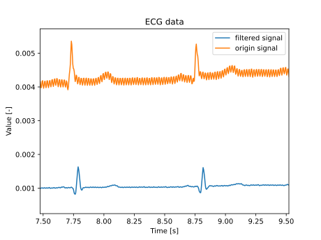

## Ex 1

The code is using collowing implementation structure:

    class FIRFilter:
        def __init__(self, impulse_response_coef: np.array) -> None:
            """
            FIR filter setup method, that converts class into function like (callable) object
            :param impulse_response_coef: FIR filter coefficients
            """
    
        def __call__(self, new_val: float) -> float:
            """
            Filter object executable method
            :param new_val: new input value
            :return: filtered output (delayed compared to input)
            """
    
        def do_filter(self):
            """
            Filter execution for given past states and filter coefficients
            :return: single step filtered output
            """
Mentioned design was selected because:
 - class design allows code reusability and easy access from other python modules
 - the call method was used due to "functional" character of the task
 - allows class inheritance for higher level classes
 
 To provide the 'queue' like data structure we used the ```deque``` class from ```collections```. It is high optimized python data structure that supports fixed buffer size and ``` append ``` functionality.
 
 
 ## Ex 2
 
 For the basic implementation test we wrote two basic unittests. 
 
 
    class TestFIR(unittest.TestCase):
        """
        Testing area
        """
        def test_initialization(self):
            """
            Smoke unit test.
            Checks if the initialization and inheritance do not break
            """
    
        def test_fir_base_class(self):
            """ 
            Test FIR responce to the impulse - for predefined coefficents.
            """
    
 The test are executed when the file is executed as the main script.
 
  ## Ex 3
  
  According to Szymon's university number we have selected following data file: ```ECG_msc_matric_3.dat ```.
  
  To remove the DC and 50Hz noise we designed the FIR factory that extends ```FIRFilter``` class and calculates the FIR filter coefficients.
  The ```FIRFilterFactory```, except number of tabs in filer, it takes the frequency range to remove, and window type. 
  
    class FIRFilterFactory(FIRFilter):
        def __init__(self, num_taps: int, norm_freq_list: list, pass_zero: bool, window_type: 'str' = 'triangle') -> None:
            """
            FIR filter designed (based on the FIRFilter class)
            :param num_taps: number of tabs in the FIR filter
            :param norm_freq_list: list of frequencies to remove
            :param pass_zero: flag if first given frequency is passed or removed
            :param window_type: filter window type
            """
    
        def _initialize_impulse_response(self) -> np.array:
            """
            Based on the defined cutoff frequency - design the FIR filter coefficients
            :return: raw filter coefficients
            """
    
        def _initialize_window(self) -> np.array:
            """
            Initialized the window coefficients for given window type
            :return: window coefficients
            """

For this exercise we initialize FIR filter with 30 taps, cutoff frequency at ~<0, 10>Hz and ~<40, 60>Hz.
The first region corresponds to DC removal and later for the 50Hz removal. In addition, to get better performance, we apply triangle window to the FIR coefficients.

The data processing is done in 'sudo' real time manner:

    ######   INITIALIZATION   ###### 
    fr = 250
    freq = [x / fr for x in [0, 10, 40, 60]]
    my_fir = FIRFilterFactory(30, freq)
    output_list = np.zeros(len(ecg_vals))
    
    ######   DATA HANDLING   ###### 
    for idx, val in enumerate(ecg_vals):
        output_list[idx] = my_fir(val)

Using mentioned code we achieved following results:


__Fig. 1__: ECG full data: before and after filtering using FIR filter


__Fig. 2__: Zoomed Fig. 1; it can be seen that the PQRST is intacted, and noise was (mostly) removed.

! TODO: Decide which cutoff frequencies are needed and provide explanations by referring to the spectra and/or fundamental frequencies.